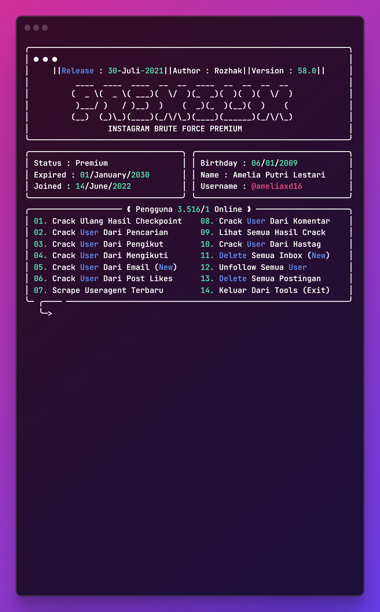
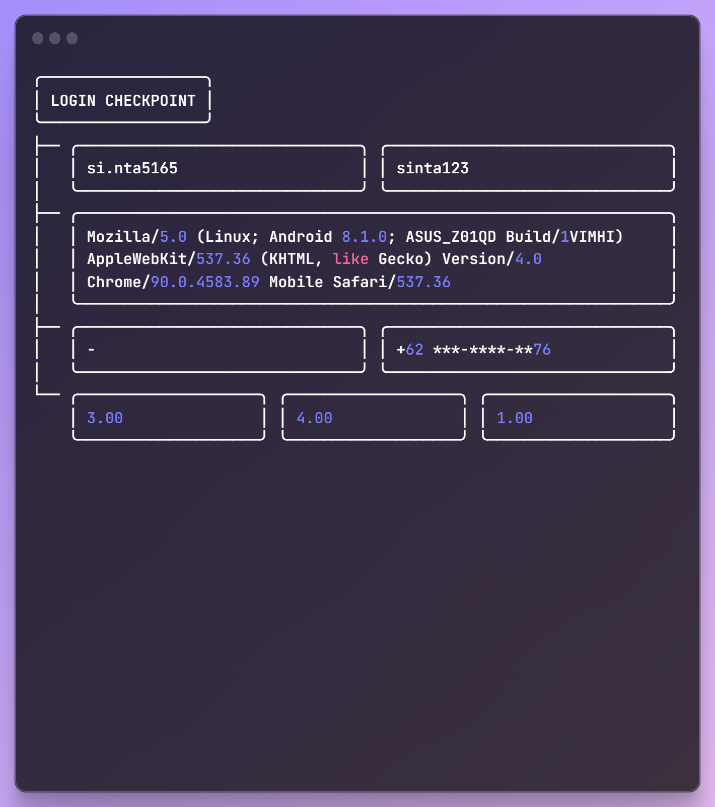
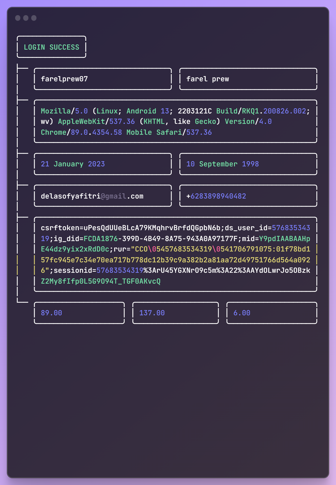

# Instagram Brute Force Premium - From Indonesian

Made with ❤️ by <a href="https://github.com/rozhakxd">Rozhak</a>

## Features in tools

## Checkpoint results

## Success results

## Installation
### Termux / Windows PowerShell / Pydroid 3

You can install the latest version of Termux at [here](https://f-droid.org/repo/com.termux_118.apk).

### Termux

    apt update -y && apt upgrade -y
    pkg install git
    pkg install python3
    
    git clone https://github.com/RozhakXD/Premium
    cd Premium
    python3 -m pip install -r requirements.txt

## Usage

    python3 Prem.py

## Thank you
